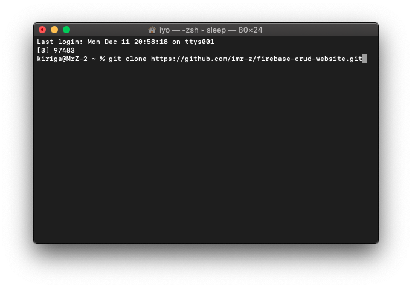
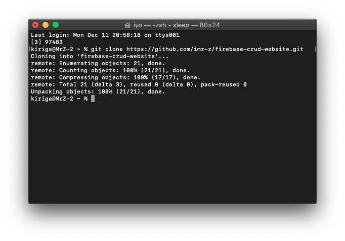
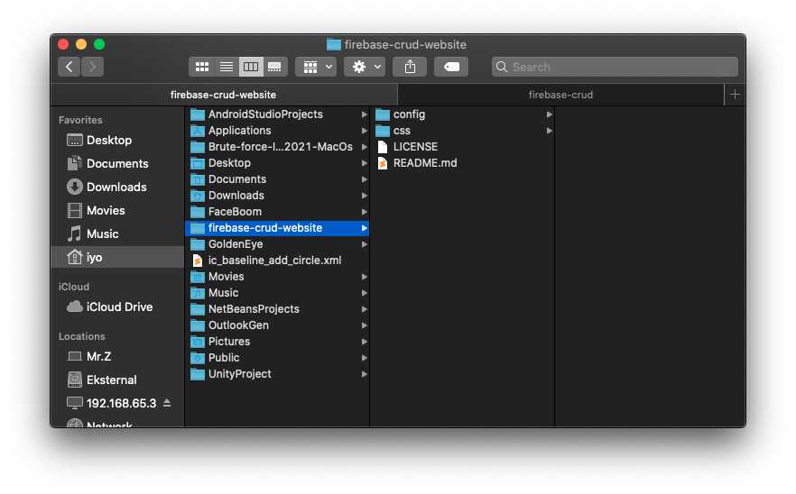

# Download Git Bash
[Open Me](https://git-scm.com/downloads)

# Firebase CRUD Website
```txt
git clone https://github.com/imr-z/firebase-crud-website.git
```

## Solution to this problem is to remove the git proxies.

```txt
Open your terminal through the administrator.
Then hit command git config --global -l
Then unset all HTTP and https proxies by below command
git config --global --unset-all http.proxy & git config --global --unset-all https.proxy
Now you can check it is removed from the list or not with the same command git config --global -l
```

# Screenshot
[](screenshoot/ss-001.png)
[](screenshoot/ss-002.png)
[](screenshoot/ss-003.png)
